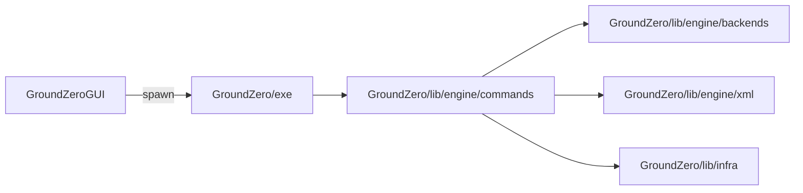

# 系统设计

## 子系统

- **CLI**：解析 argv，校验全局选项，按子命令名分发。
- **命令层**：实现业务编排（扫描、建图、写缓存、调后端）。
- **后端层**：隔离 CMake / Ninja / CTest / 归档等外部工具调用细节。
- **GUI**：不链接 `GroundZero/lib/` 或 `GroundZero/exe/`；通过子进程调用 `gz`，传递 cwd 与参数。

**`gz_reverse_cmake/`**（可执行名 `gz_reverse_cmake`）与主工程同根 **`add_subdirectory`** 构建，**`install(..., COMPONENT gz_runtime)`** 与 **`gz`**、**`gz-gui`** 同发至 **`bin/`**；逻辑上仍**不纳入**上图（不链接 `gz-lib`，不进入 `gz configure` 运行期），**仅**静态读 **`CMakeLists.txt`** 子集并**生成** `package.xml` / `target.xml` 初稿（**不**运行 `cmake` configure、**不**用 File API）。详见 [detailed-design-gz-reverse-cmake.md](detailed-design-gz-reverse-cmake.md) 与 `02-physical/gz-reverse-cmake/`。

## 主数据流

1. **configure**：文件系统扫描 → 解析 XML → 对 **`target.xml` 的 `type=` 做白名单校验**（与 **`doc/zh/package-target-xml-spec.md` §3.1** 及实现 `GroundZero/lib/engine/commands/configure.cpp` 一致，未知类型则 **configure** 失败，**退出码 5**）→ 构建内存图 → 写 `.intermediate/build/<leaf>/` 下生成物与 `gz_cache.txt`（含 **`arch=`**）。
2. **build**：以 `<leaf>` 定位构建目录 → 读 `arch` 与 `GZ_TARGET_BUILD_SYSTEM` 等 → 安装到 **`.intermediate/install/<arch>/`**。
3. **run / test / pack**：以 **`--install-dir-name`** 指向的安装前缀（即上述 `<arch>` 目录名）定位 `bin/` 与测试元数据。

## 与概念阶段一致性

- 「数据即行为」体现在 XML 描述 + 命令层解释器 + 后端生成器三者分离。
