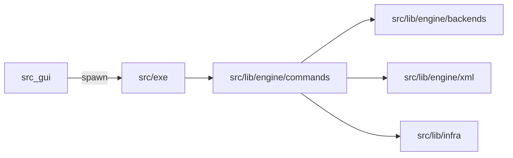

# 系统设计

## 子系统

- **CLI**：解析 argv，校验全局选项，按子命令名分发。
- **命令层**：实现业务编排（扫描、建图、写缓存、调后端）。
- **后端层**：隔离 CMake / Ninja / CTest / 归档等外部工具调用细节。
- **GUI**：不链接 `src/lib/` 或 `src/exe/`；通过子进程调用 `up`，传递 cwd 与参数。

## 主数据流

1. **configure**：文件系统扫描 → 解析 XML → 构建内存图 → 写 `.intermediate/build/<leaf>/` 下生成物与 `up_cache.txt`（含 **`arch=`**）。
2. **build**：以 `<leaf>` 定位构建目录 → 读 `arch` 与 `UP_TARGET_BUILD_SYSTEM` 等 → 安装到 **`.intermediate/install/<arch>/`**。
3. **run / test / pack**：以 **`--install-dir-name`** 指向的安装前缀（即上述 `<arch>` 目录名）定位 `bin/` 与测试元数据。

## 与概念阶段一致性

- 「数据即行为」体现在 XML 描述 + 命令层解释器 + 后端生成器三者分离。
