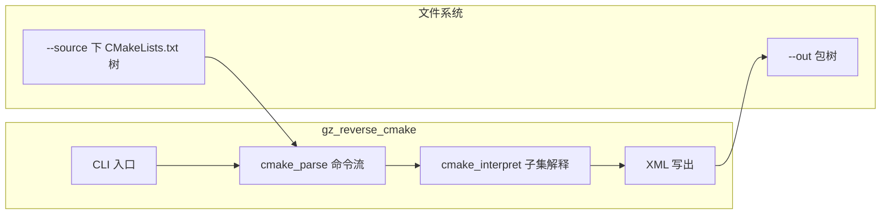

# 组件 UML：gz_reverse_cmake

```mermaid
flowchart LR
  subgraph tool["gz_reverse_cmake"]
    CLI[CLI 入口]
    LEX[cmake_parse 命令流]
    INT[cmake_interpret 子集解释]
    EM[XML 写出]
  end
  subgraph fs["文件系统"]
    S["--source 下 CMakeLists.txt 树"]
    O[--out 包树]
  end
  CLI --> LEX
  LEX --> INT
  INT --> EM
  EM --> O
  S --> LEX
```

- **与 GroundZero 主库**：不链接 `gz-lib`；不调用 `cmake` 可执行文件；独立可执行，仅读脚本并写 XML。
