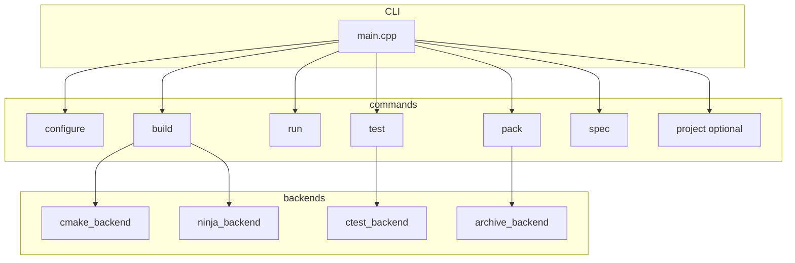

# up-cli：组件图（Mermaid）

```mermaid
flowchart TB
  subgraph cli [CLI]
    main[main.cpp]
  end
  subgraph cmds [commands]
    configure[configure]
    build[build]
    run[run]
    test[test]
    pack[pack]
    spec[spec]
    project[project optional]
  end
  subgraph backends [backends]
    cmake[cmake_backend]
    ninja[ninja_backend]
    ctest[ctest_backend]
    archive[archive_backend]
  end
  main --> configure & build & run & test & pack & spec & project
  build --> cmake & ninja
  test --> ctest
  pack --> archive
```
