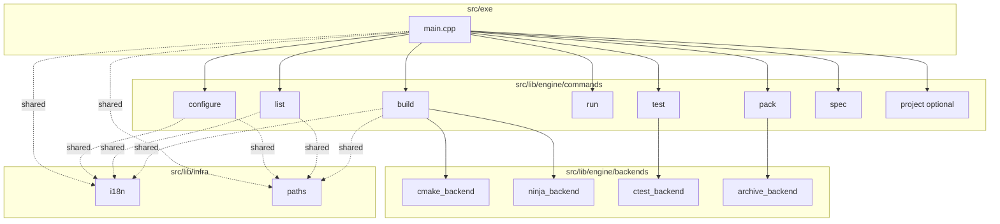

# up-cli：组件图（Mermaid）

```mermaid
flowchart TB
  subgraph exe [src/exe]
    main[main.cpp]
  end
  subgraph libcmd [src/lib/engine/commands]
    configure[configure]
    list[list]
    build[build]
    run[run]
    test[test]
    pack[pack]
    spec[spec]
    project[project optional]
  end
  subgraph libback [src/lib/engine/backends]
    cmake[cmake_backend]
    ninja[ninja_backend]
    ctest[ctest_backend]
    archive[archive_backend]
  end
  subgraph libinfra [src/lib/infra]
    i18n[i18n]
    paths[paths]
  end
  main --> configure & list & build & run & test & pack & spec & project
  main -.shared.-> i18n & paths
  configure -.shared.-> i18n & paths
  list -.shared.-> i18n & paths
  build -.shared.-> i18n & paths
  build --> cmake & ninja
  test --> ctest
  pack --> archive
```
