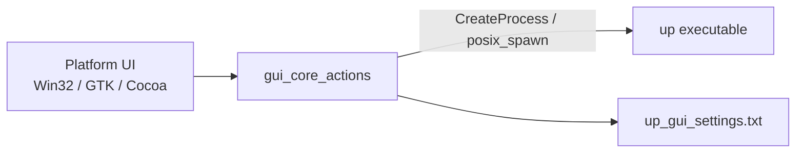

# up-gui：组件图（Mermaid）

```mermaid
flowchart LR
  UI[Platform UI\nWin32 / GTK / Cocoa] --> Core[gui_core_actions]
  Core -->|CreateProcess / posix_spawn| UpExe[up executable]
  Core --> Settings[up_gui_settings.txt]
```
