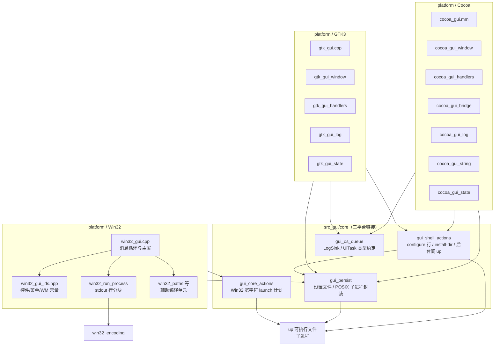

# up-gui：组件图（Mermaid）

```mermaid
flowchart TB
  subgraph Core["src_gui/core（三平台链接）"]
    Persist[gui_persist\n设置文件 / POSIX 子进程封装]
    Shell[gui_shell_actions\nconfigure 行 / install-dir / 后台调 up]
    CoreActions[gui_core_actions\nWin32 宽字符 launch 计划]
    OsQueue[gui_os_queue\nLogSink / UiTask 类型约定]
  end

  subgraph Win32["platform / Win32"]
    WMain[win32_gui.cpp\n消息循环与主窗]
    WIds[win32_gui_ids.hpp\n控件/菜单/WM 常量]
    WRunProc[win32_run_process\nstdout 行分块]
    WPaths[win32_paths 等\n辅助编译单元]
  end

  WMain --> WIds
  WMain --> WRunProc
  WRunProc --> WEnc[win32_encoding]
  WMain --> WPaths

  subgraph Gtk["platform / GTK3"]
    GRun[gtk_gui.cpp]
    GWin[gtk_gui_window]
    GHandlers[gtk_gui_handlers]
    GLog[gtk_gui_log]
    GState[gtk_gui_state]
  end

  subgraph Cocoa["platform / Cocoa"]
    CRun[cocoa_gui.mm]
    CWin[cocoa_gui_window]
    CH[cocoa_gui_handlers]
    CBridge[cocoa_gui_bridge]
    CLog[cocoa_gui_log]
    CString[cocoa_gui_string]
    CState[cocoa_gui_state]
  end

  Win32 --> CoreActions
  Win32 --> Persist
  Gtk --> Persist
  Gtk --> Shell
  Gtk --> OsQueue
  Cocoa --> Persist
  Cocoa --> Shell
  Cocoa --> OsQueue

  Shell --> Persist
  CoreActions --> UpExe[up 可执行文件\n子进程]
  Persist --> UpExe
  Shell --> UpExe
```

更细的「符号 → 路径」表见同目录 `mapping.md`。
