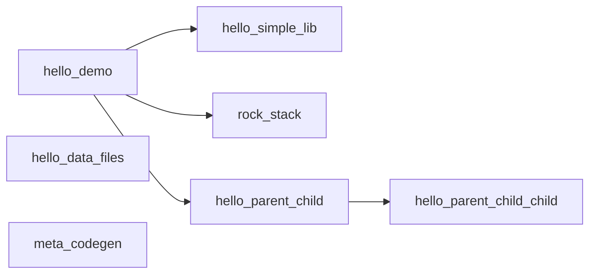

# test_projects

本目录下每一个子目录都是一个独立测试包：根目录放 `package.xml`；每个 CMake 目标独占一个子目录，子目录内恰好一个 `target.xml`。`<sources>` 中的路径相对于该 `target.xml` 所在目录。`configure` 会为整包生成 `add_library` / `add_executable` 并将同包下库链接到各可执行目标。

与 `build.py` / `install.py` 的关系：仓库根的 `build.py`、`install.py` 只构建并安装宿主工具 `up.exe` 与 `up-gui.exe`，不包含、不编译、不安装 `test_projects/` 下的测试包。

## 子项目一览

| 子目录 | 一句话 |
|--------|--------|
| [hello_simple_lib/](hello_simple_lib/) | 最简单独立静态库包：`hello_simple_lib`、`hello_simple_lib_tool`、`hello_simple_lib_test`。 |
| [hello_demo/](hello_demo/) | 演示本包 `hello_foo` + 跨包 `hello_simple_lib`、`rock_stack`、`hello_parent_child` 的联合调用与测试。 |
| [rock_stack/](rock_stack/) | 演示 `include/src/app/test` 布局及 `includes` 的 `dir/file/glob` 三种 `from/to` 写法。 |
| [hello_parent_child/](hello_parent_child/) | 演示父子嵌套包（父包依赖子包）与跨包目标引用 `pkg:target`。 |
| [hello_data_files/](hello_data_files/) | 演示 `xml/json/svg` 数据文件随安装产物落盘并由可执行程序启动加载。 |
| [meta_codegen/](meta_codegen/) | 演示 `moc/uic/rc` 风格代码生成工具：`.h -> .meta.cpp`、`.ui -> .h+.cpp`、`.rc -> .h+.cpp`。 |

### 包依赖关系



- `hello_simple_lib`：无包级依赖。
- `rock_stack`：无包级依赖。
- `hello_demo`：依赖 `hello_simple_lib`、`rock_stack`、`hello_parent_child`（另有可选占位 `none`）。
- `hello_parent_child_child`：无包级依赖（子包）。
- `hello_parent_child`：依赖 `hello_parent_child_child`（父包）。
- `hello_data_files`：无包级依赖（资源文件安装与运行时加载示例）。
- `meta_codegen`：无包级依赖（代码生成工具示例）。

---

## hello_simple_lib

定位：最简独立 C++ 库包，验证“库 + 工具可执行 + 单元测试可执行”的基本模式。

- 包名：`hello_simple_lib`
- 目标：
  - `hello_simple_lib`（`static_library`）
  - `hello_simple_lib_tool`（`executable`）
  - `hello_simple_lib_test`（`executable`）

库 API：`version`、`normalize_name`、`add`、`Counter`、`Greeter`、`make_range`。

---

## hello_demo

定位：演示包内多目标 + 跨包依赖调用。

- 包名：`hello_demo`
- 依赖包：`hello_simple_lib`、`rock_stack`、`hello_parent_child`（及可选占位 `none`）
- 目标：
  - `hello_foo`（本包静态库）
  - `hello_demo`（主程序，调用 `hello_foo` + `hello_simple_lib` + `hello_parent_child:parent_lib` + `rock_stack`）
  - `hello_foo_test`（本包单测）

---

## rock_stack

定位：演示 `include/<库名>/`、`src/<库名>/`、`app/`、`test/` 的常见拆分。

- 包名：`rock_stack`
- 库目标：`rockBase`、`rockNet`、`rockBus`
- 可执行：`rock_app_one`、`rock_app_two`
- 测试：`rockBase_test`、`rockNet_test`、`rockBus_test`

`includes` 新语法示例（相对 `target.xml`）：

- `dir`：`<dir from="../../include/rockBase" to="rockBase"/>`
- `file`：`<file from="../../include/rockNet/rock_net.hpp" to="rockNet"/>`
- `glob`：`<glob from="../../include/rockBus/*.hpp" to="rockBus"/>`

---

## hello_parent_child

定位：演示“父目录与子目录都含 `package.xml`”的嵌套包关系，以及父包依赖子包并链接子包目标。

- 父包：`hello_parent_child`
- 子包：`hello_parent_child_child`（位于 `hello_parent_child/child_pkg/`）
- 父包目标：`hello_parent_child_app`（`executable`）、`parent_lib`（`static_library`）
- 子包目标：`hello_parent_child_child_lib`（`static_library`）
- 依赖关系：
  - 父包通过 `<dependency name="hello_parent_child_child:hello_parent_child_child_lib"/>` 调用子包库 API
  - 外部包（如 `hello_demo`）可通过 `<dependency name="hello_parent_child:parent_lib"/>` 复用父包导出库

---

## hello_data_files

定位：演示 `target.xml` 中 `includes` 的 `glob from/to` 用法，把非代码资源（`xml/json/svg`）安装到前缀目录并由程序运行时读取。

- 包名：`hello_data_files`
- 目标：`data_loader`（`executable`）
- 资源目录：`hello_data_files/assets/`
- 安装规则：`<glob from="../assets/*.*" to="hello_data_files"/>`
- 运行时读取路径：`<install_prefix>/include/hello_data_files/`

---

## meta_codegen

定位：演示元编程/代码生成工具链。包含 4 个可执行程序：

- `moc`：输入 `.h`，输出对应 `.meta.cpp`
- `uic`：输入 `.ui`，输出对应 `.h` + `.cpp`
- `rc`：输入 `.rc`，输出对应 `.h` + `.cpp`
- `meta_codegen_demo`：校验生成文件存在且含预期符号（端到端 smoke test）

示例输入位于：`meta_codegen/samples/`
工具目录已合并为：`meta_codegen/meta_tool/{moc,uic,rc}/`

---

## 在仓库根目录执行（已构建 `up.exe`）

```powershell
.\_build\Release\up.exe configure --scan test_projects
.\_build\Release\up.exe build
.\_build\Release\up.exe test
.\_build\Release\up.exe run hello_demo
```

单独验证数据文件安装与加载（在 `test_projects` 目录内）：

```powershell
Set-Location test_projects
..\_build\Release\up.exe configure --scan .
..\_build\Release\up.exe build
..\_build\Release\up.exe run data_loader
```

单独验证元编程工具示例（在 `test_projects` 目录内）：

```powershell
Set-Location test_projects
..\_build\Release\up.exe configure --scan .
..\_build\Release\up.exe build
..\_build\Release\up.exe run moc .\meta_codegen\samples\widget.h .\meta_codegen\samples\widget.meta.cpp
..\_build\Release\up.exe run uic .\meta_codegen\samples\main_panel.ui .\meta_codegen\samples\ui_main_panel.h .\meta_codegen\samples\ui_main_panel.cpp
..\_build\Release\up.exe run rc .\meta_codegen\samples\app.rc .\meta_codegen\samples\rc_app.h .\meta_codegen\samples\rc_app.cpp
..\_build\Release\up.exe run meta_codegen_demo
```

仅验证父子包示例（在 `test_projects` 目录内）：

```powershell
Set-Location test_projects\hello_parent_child
..\..\_build\Release\up.exe configure
..\..\_build\Release\up.exe build
..\..\_build\Release\up.exe test
..\..\_build\Release\up.exe run hello_parent_child_app
```

单独运行 `hello_simple_lib` 包内工具：

```powershell
.\_build\Release\up.exe run hello_simple_lib_tool
```

在 `rock_stack` 包目录单独执行：

```powershell
Set-Location test_projects\rock_stack
..\_build\Release\up.exe configure
..\_build\Release\up.exe build
..\_build\Release\up.exe test
..\_build\Release\up.exe run rock_app_one
```
