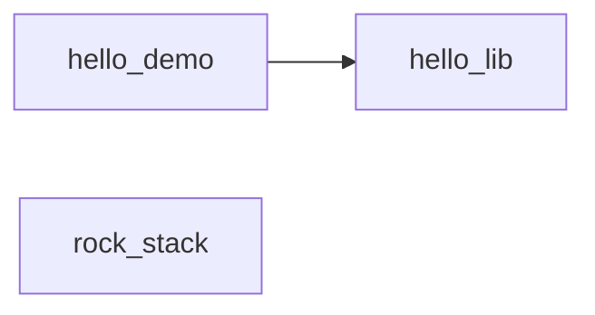

# test_projects

本目录下**每一个子目录**都是一个独立的测试包：根目录放 **`package.xml`**；**每个 CMake 目标独占一个子目录**，该子目录内**恰好一个** **`target.xml`**（不得在同一目录堆叠多个 target 描述文件）。`<sources>` 中的路径相对于该 `target.xml` 所在目录。`configure` 会为整包生成 `add_library` / `add_executable` 并将同包下的库链接到各可执行目标。

**与 `build.py` / `install.py` 的关系**：仓库根的 `build.py`、`install.py` **只**构建并安装宿主工具 **`up.exe`** 与 **`up-gui.exe`**，**不包含、不编译、不安装** `test_projects/` 下的任何测试包。测试包由你在选好目录后运行 **`up configure` / `up build`** 等命令驱动；产物在当时的 **cwd** 下 **`.intermediate/`** 中生成，与本仓库根 `_build` 无关。

## 子项目一览

| 子目录 | 一句话 |
|--------|--------|
| [hello_lib/](hello_lib/) | 独立静态库包：演示库、`hello_lib_tool` 命令行与 `hello_lib_test` 自测。 |
| [hello_demo/](hello_demo/) | 演示多子目录、本包内 `hello_foo` 静态库、跨包依赖 `hello_lib`，以及针对 `hello_foo` 的测试可执行体。 |
| [rock_stack/](rock_stack/) | 演示 **`include/<库名>/`**、**`src/<库名>/`**（**`target.xml` 与 `.cpp` 同目录**）、**`app/`** 两程序、**`test/`** 每库一单测；三库 `rockBase` / `rockNet` / `rockBus`。 |

### 包依赖关系

下图表示各包在 **`package.xml` 中声明的包级依赖**：箭头从**依赖方**指向**被依赖的包**（与 `configure` 校验「target 引用外包包须在 `package.xml` 中声明」的规则一致）。



- **`hello_lib`**：未声明对其他包的依赖。
- **`hello_demo`**：声明依赖 **`hello_lib`**（其 `target.xml` 中 `hello_lib:hello_lib` 等引用需与此一致）。
- **`hello_demo`** 中的 **`<dependency name="none" optional="true"/>`** 为可选占位项，**不对应** `test_projects/` 下的子目录，故图中不画出节点。
- **`rock_stack`**：未声明对其他测试包的依赖（独立布局示例包）。

---

## hello_lib

**定位**：不依赖其他测试包的**基础库示例**，展示「一个包里同时有静态库、演示用可执行程序、单元测试可执行程序」的典型布局。

**包元数据**（`package.xml`）：包名 `hello_lib`，版本 `0.1.0`。

**目标与目录**：

| 目录 | `target` 名 | 类型 | 说明 |
|------|-------------|------|------|
| `hello_lib/` | `hello_lib` | `static_library` | 实现 `hello_lib` 命名空间 API，头文件与实现同目录；`includes` 指向当前目录以便 `#include "hello_lib.hpp"`。 |
| `hello_lib_tool/` | `hello_lib_tool` | `executable` | 命令行小工具，通过相对路径包含库头文件，调用 `Counter`、`Greeter`、`normalize_name`、`version`、`add`、`make_range` 等并打印结果。 |
| `hello_lib_test/` | `hello_lib_test` | `executable` | 对库 API 做 `assert` 自检（版本字符串、字符串规范化、加法、`Counter`、`Greeter`、`make_range` 等），供 `up test` / CTest 运行。 |

**库 API 概要**（`hello_lib.hpp` / `hello_lib.cpp`）：`version()`；`normalize_name`（转小写）；`add`；`Counter`；`Greeter`（拼接问候语）；`make_range(n)`（生成 `0..n-1` 向量）。

**构建注意**：`configure` 生成 CMake 时，**同一包内**每个可执行 target 会 **PRIVATE 链接本包中全部库 target**（因此 `hello_lib_tool`、`hello_lib_test` 的 `target.xml` 不必再写对 `hello_lib` 的 `<dependency>`，仍能正确链接静态库；跨包依赖则须在 `package.xml` / `target.xml` 中显式声明）。

---

## hello_demo

**定位**：演示**包内多 target 子目录**、**本包静态库 `hello_foo`**，以及通过 `<dependency name="hello_lib"/>` **依赖另一测试包 `hello_lib`** 的跨包链接与头文件使用（主程序里 `hello_lib:hello_lib` 形式引用库 target）。

**包元数据**（`package.xml`）：包名 `hello_demo`，声明依赖 `hello_lib`（以及占位用的 `none` 可选依赖）；用于验证多包扫描与包间依赖解析。

**目标与目录**：

| 目录 | `target` 名 | 类型 | 说明 |
|------|-------------|------|------|
| `hello_foo/` | `hello_foo` | `static_library` | 提供 `foo_print()`、`Foo` 类（带 `tag`、`greet` 等），供主程序与测试使用。 |
| `hello_demo/` | `hello_demo` | `executable` | 入口 `main.cpp`：调用 `hello_foo` 与 `hello_lib`（`version`、`add`、`Greeter`），验证本包库 + 跨包库同时链接。 |
| `hello_foo_test/` | `hello_foo_test` | `executable` | 直接包含 `../hello_foo/foo.hpp`，对 `Foo` 与 `foo_print` 做简单断言式「单元测试」；同包链接规则下会链接本包 `hello_foo`，**不**使用 `hello_lib`，用于单独验证该库行为。 |

**与测试的关系**：`hello_foo_test` 与 `hello_demo` 在 `up test` / CTest 中通常都会作为测试条目出现（具体以生成规则为准）；`hello_foo_test` 专注测试本包 `hello_foo`，`hello_demo` 侧重端到端演示含跨包依赖的主程序。

---

## rock_stack

**定位**：演示 **`include/<库名>/`**、**`src/<库名>/`**、**`app/`**、**`test/`** 的常见拆分：每个库的 **`target.xml` 与对应 `.cpp` 同放在 `src/rockBase/`**（及 `rockNet`、`rockBus`）；头文件在 **`include/rockBase/`** 等，由 `target.xml` 中 **`<dir>../../include/rockBase</dir>`**（相对 `target.xml` 所在目录）加入包含路径；应用与测试各占用独立子目录，每目录一个 `target.xml`。

**包元数据**（`package.xml`）：包名 `rock_stack`，版本 `0.1.0`，无包级依赖。

**目录与目标概览**：

| 区域 | 路径 | 说明 |
|------|------|------|
| 头文件 | `include/rockBase/`、`include/rockNet/`、`include/rockBus/` | 各库对外头文件（如 `rock_base.hpp`），供 `#include <rock_base.hpp>` 等。 |
| 库 | `src/rockBase/`、`src/rockNet/`、`src/rockBus/` | 各目录内 **`target.xml` + `rock_*.cpp`**；`<file>` 为同目录源文件。三库 API 互相独立（适应当前 `configure` 不为静态库生成库间链接的行为）。 |
| 应用 | `app/rock_app_one/`、`app/rock_app_two/` | 两个可执行程序，各一 `target.xml` + `main.cpp`；同包可执行程序会链接本包全部静态库。 |
| 测试 | `test/rockBase_test/`、`test/rockNet_test/`、`test/rockBus_test/` | 每库一个可执行单测（`assert`），由 CTest / `up test` 运行。 |

---

## 在仓库根目录执行（已构建 `up.exe`）

对 **`test_projects` 下全部包** 一次性配置并构建、测试、运行主程序示例：

```powershell
.\_build\Release\up.exe configure --scan test_projects
.\_build\Release\up.exe build
.\_build\Release\up.exe test
.\_build\Release\up.exe run hello_demo
```

`hello_demo` 包内 **`hello_foo_test/`** 子目录含测试可执行体的 **`target.xml`**；`up test` / CTest 会运行 **`hello_foo_test`** 与主程序 **`hello_demo`** 等相关用例（若工程同时注册了 `hello_lib` 包，也会包含 **`hello_lib_test`** 等）。

单独运行 **`hello_lib`** 包内的工具示例（在已 configure 且 build 成功的前提下）：

```powershell
.\_build\Release\up.exe run hello_lib_tool
```

或在某一子包目录内将 `up` 加入 `PATH` 后，直接 `up configure`（默认扫描当前目录，仅包含该包）。

**`rock_stack` 单包示例**（在 `test_projects/rock_stack` 下）：

```powershell
Set-Location test_projects\rock_stack
..\_build\Release\up.exe configure
..\_build\Release\up.exe build
..\_build\Release\up.exe test
..\_build\Release\up.exe run rock_app_one
```
