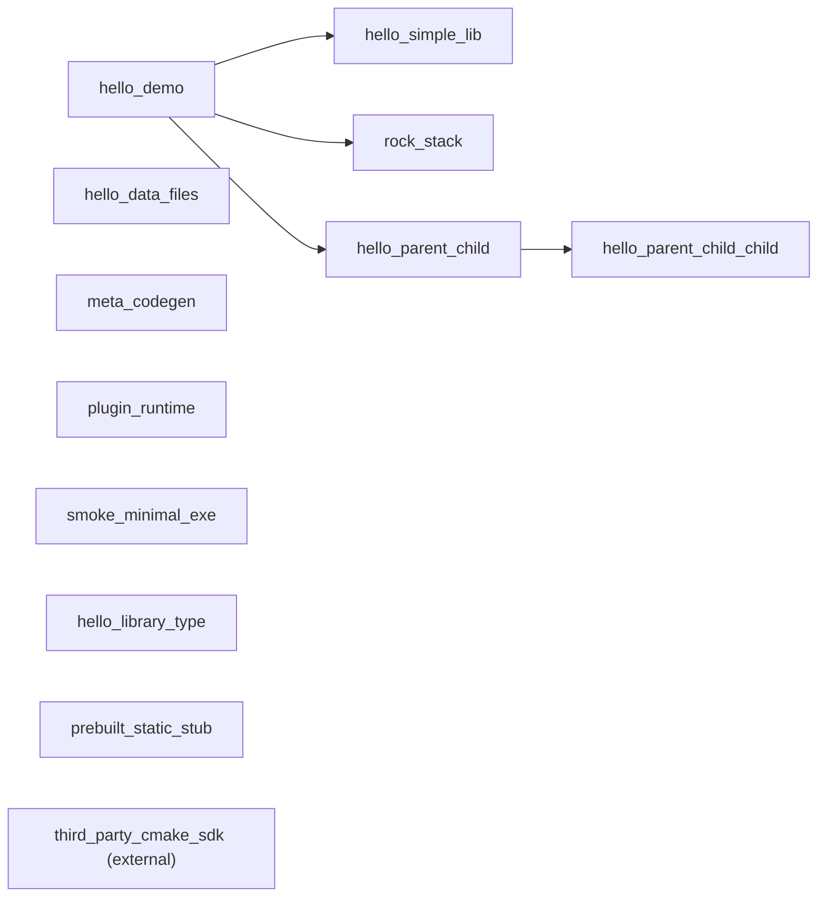

# test_projects

本目录下每一个子目录都是一个独立测试包：根目录放 `package.xml`；每个 CMake 目标独占一个子目录，子目录内恰好一个 `target.xml`。`<sources>` 中的路径相对于该 `target.xml` 所在目录。`configure` 会为整包生成 `add_library` / `add_executable` 并将同包下库链接到各可执行目标。

与 `build.py` / `install.py` 的关系：仓库根的 `build.py`、`install.py` 只构建并安装宿主工具 `gz.exe` 与 `gz-gui.exe`，不包含、不编译、不安装 `test_projects/` 下的测试包。

## 子项目一览

| 子目录 | 一句话 |
|--------|--------|
| [hello_simple_lib/](hello_simple_lib/) | 最简单独立静态库包：`hello_simple_lib`、`hello_simple_lib_tool`、`hello_simple_lib_test`。 |
| [hello_demo/](hello_demo/) | 演示本包 `hello_foo` + 跨包 `hello_simple_lib`、`rock_stack`、`hello_parent_child` 的联合调用与测试。 |
| [rock_stack/](rock_stack/) | 演示 `include/src/app/test` 布局及 `<headers>` 的 `dir/file/glob` 三种 `from/to` 写法。 |
| [hello_parent_child/](hello_parent_child/) | 演示父子嵌套包（父包依赖子包）与跨包目标引用 `pkg:target`。 |
| [hello_data_files/](hello_data_files/) | 演示 `xml/json/svg` 数据文件随安装产物落盘并由可执行程序启动加载。 |
| [meta_codegen/](meta_codegen/) | 演示 `moc/uic/rc` 风格代码生成工具：`.h -> .meta.cpp`、`.ui -> .h+.cpp`、`.rc -> .h+.cpp`。 |
| [plugin_runtime/](plugin_runtime/) | 演示插件共享库动态加载：默认导出 `init/update/shutdown/info` 并由测试程序运行。 |
| [smoke_minimal_exe/](smoke_minimal_exe/) | **最小包冒烟**：仅可执行目标。 |
| [hello_library_type/](hello_library_type/) | **`type="library"`**：随 **`GZ_TARGET_DYNAMIC_LIBRARY`** 在 configure 时解析为静/动库；可执行目标依赖默认自动链接。 |
| [prebuilt_static_stub/](prebuilt_static_stub/) | 演示 **`prebuilt_static_library`** + **`<prebuilt import_lib="..."/>`**：链入预编译的 `stub_import.lib`（Windows MSVC x64 已提交 `lib/import/`；可再用 `lib/CMakeLists.txt` 重生）。 |
| third-party CMake SDK（外部目录） | **推荐**：包外 `cmake --install` 后 **vendor** 进本包，**手写** `prebuilt_*` + `<prebuilt>`（或 **`GZ_CMAKE_PREFIX_PATH`**；见 [`doc/zh/getting-started.md`](../doc/zh/getting-started.md)）。 |

### 包依赖关系



- `hello_simple_lib`：无包级依赖。
- `rock_stack`：无包级依赖。
- `hello_demo`：依赖 `hello_simple_lib`、`rock_stack`、`hello_parent_child`（另有可选占位 `none`）。
- `hello_parent_child_child`：无包级依赖（子包）。
- `hello_parent_child`：依赖 `hello_parent_child_child`（父包）。
- `hello_data_files`：无包级依赖（资源文件安装与运行时加载示例）。
- `meta_codegen`：无包级依赖（代码生成工具示例）。
- `plugin_runtime`：无包级依赖（插件动态加载示例）。
- `smoke_minimal_exe`：无包级依赖（最小可执行目标布局示例）。
- `hello_library_type`：无包级依赖（**`library`** 目标类型与 **`GZ_TARGET_DYNAMIC_LIBRARY`** 示例）。
- `prebuilt_static_stub`：无包级依赖（预编译静态库导入示例）。
- `third_party_cmake_sdk`（external）：外部目录示例节点，不属于仓库内 `test_projects/` 子目录；实际依赖关系取决于被导入 SDK 的 `package.xml/target.xml`。

补充：当前实现支持“纯库包”配置/构建（无需 executable）。第三方 SDK 也可完全由手写 **`target.xml`**（`prebuilt_*` 等）描述，不必生成 `.targets/` 目录。

## 规则化约束（重要）

`gz` / `gz-gui` 的行为是**泛化规则引擎**，不内置任何针对具体第三方项目（库名、仓库名、目录布局）的特判。  
当你在真实项目中接入第三方代码库时，若自动探测信息不足，请通过 `package.xml` / `target.xml` 显式补齐，而不是依赖工具内置“项目知识”。

最小迁移清单（无特判前提）：

1. `package.xml`
   - 声明包级依赖：`<dependency name="..."/>`
   - 在包外构建/安装上游后，将所需文件 **vendor** 进本包，在 `target.xml` 用 **`prebuilt_*`** 等声明。
2. `target.xml`
   - 预编译库：使用 `prebuilt_static_library` / `prebuilt_shared_library` + `<prebuilt .../>`（路径相对 `target.xml` 或绝对路径）
   - Windows 的 `prebuilt_shared_library` 需能解析 **`.dll`** 与 **import `.lib`**
   - 头文件目录用 **`<headers>`**（`from` 相对 `target.xml`）显式声明
3. 依赖引用
   - 包内：`<dependency name="myLib"/>`
   - 跨包：`<dependency name="otherPkg:otherLib"/>`
   - CMake 后端可选 **`visibility="private|public|interface"`**（默认 `private`）；可执行目标不得使用 `interface`。细则见 **`gz spec`** 与 `doc/zh/package-target-xml-spec.md`。

---

## hello_simple_lib

定位：最简独立 C++ 库包，验证“库 + 工具可执行 + 单元测试可执行”的基本模式。

- 包名：`hello_simple_lib`
- 目标：
  - `hello_simple_lib`（`static_library`）
  - `hello_simple_lib_tool`（`executable`）
  - `hello_simple_lib_test`（`executable`）

库 API：`version`、`normalize_name`、`add`、`Counter`、`Greeter`、`make_range`。

---

## hello_demo

定位：演示包内多目标 + 跨包依赖调用。

- 包名：`hello_demo`
- 依赖包：`hello_simple_lib`、`rock_stack`、`hello_parent_child`（及可选占位 `none`）
- 目标：
  - `hello_foo`（本包静态库）
  - `hello_demo`（主程序，调用 `hello_foo` + `hello_simple_lib` + `hello_parent_child:parent_lib` + `rock_stack`）
  - `hello_foo_test`（本包单测）

---

## rock_stack

定位：演示 `include/<库名>/`、`src/<库名>/`、`app/`、`test/` 的常见拆分。

- 包名：`rock_stack`
- 库目标：`rockBase`、`rockNet`、`rockBus`
- 可执行：`rock_app_one`、`rock_app_two`
- 测试：`rockBase_test`、`rockNet_test`、`rockBus_test`

`<headers>` 新语法示例（相对 `target.xml`）：

- `dir`：`<dir from="../../include/rockBase" to="rockBase"/>`
- `file`：`<file from="../../include/rockNet/rock_net.hpp" to="rockNet"/>`
- `glob`：`<glob from="../../include/rockBus/*.hpp" to="rockBus"/>`

---

## hello_parent_child

定位：演示“父目录与子目录都含 `package.xml`”的嵌套包关系，以及父包依赖子包并链接子包目标。

- 父包：`hello_parent_child`
- 子包：`hello_parent_child_child`（位于 `hello_parent_child/child_pkg/`）
- 父包目标：`hello_parent_child_app`（`executable`）、`parent_lib`（`static_library`）
- 子包目标：`hello_parent_child_child_lib`（`static_library`）
- 依赖关系：
  - 父包通过 `<dependency name="hello_parent_child_child:hello_parent_child_child_lib"/>` 调用子包库 API
  - 外部包（如 `hello_demo`）可通过 `<dependency name="hello_parent_child:parent_lib"/>` 复用父包导出库

---

## hello_data_files

定位：演示 `target.xml` 中 `assets` 的 `glob from/to` 用法，把非代码资源（`xml/json/svg`）安装到前缀目录并由程序运行时读取。

- 包名：`hello_data_files`
- 目标：
  - `data_loader`（`executable`，依赖 `hello_data_assets`）
  - `hello_data_assets`（`asset_bundle`，资源安装目标）
- 资源目录：`hello_data_files/assets/`
- 安装规则：`hello_data_assets/target.xml` 中声明 `<assets><glob from="./*.*" to="assets/hello_data_files"/></assets>`
- 运行时读取路径：`<install_prefix>/assets/hello_data_files/`

---

## meta_codegen

定位：演示元编程/代码生成工具链。包含 3 个可执行程序：

- `moc`：输入 `.h`，输出对应 `.meta.cpp`（默认输出到 `.intermediate/generated/`）
- `uic`：输入 `.ui`，输出对应 `.h` + `.cpp`（默认输出到 `.intermediate/generated/`）
- `rc`：输入 `.rc`，输出对应 `.h` + `.cpp`（默认输出到 `.intermediate/generated/`）

示例输入位于：`meta_codegen/samples/`
工具目录已合并为：`meta_codegen/meta_tool/{moc,uic,rc}/`

---

## plugin_runtime

定位：演示“插件是特殊共享库”的运行时加载场景。插件默认导出 4 个动态加载函数：`init`、`update`、`shutdown`、`info`。

- 包名：`plugin_runtime`
- 插件目标：`plugin_lib`（`shared_library`）
- 测试目标：`plugin_loader_test`（`executable`）
- 验证方式：测试程序在运行时加载插件并查找上述 4 个导出函数，调用后打印结果

---

## 在仓库根目录执行（已构建 `gz.exe`）

> **路径**：下列 **`.\_build\Release\`** 中的 **`_build`** 为 CMake 构建目录示例名，请与你在仓库根执行 **`cmake -B ...`** 时使用的目录一致（例如 **`_build_gz\Release\`**）。

```powershell
.\_build\Release\gz.exe configure --scan test_projects
.\_build\Release\gz.exe build
.\_build\Release\gz.exe test
.\_build\Release\gz.exe run hello_demo
```

单独验证数据文件安装与加载（在 `test_projects` 目录内）：

```powershell
Set-Location test_projects
..\_build\Release\gz.exe configure --scan .
..\_build\Release\gz.exe build
..\_build\Release\gz.exe run data_loader
```

单独验证元编程工具示例（在 `test_projects` 目录内）：

```powershell
Set-Location test_projects
..\_build\Release\gz.exe configure --scan .
..\_build\Release\gz.exe build
..\_build\Release\gz.exe run moc
..\_build\Release\gz.exe run uic
..\_build\Release\gz.exe run rc
```

单独验证插件加载示例（在 `test_projects` 目录内）：

```powershell
Set-Location test_projects\plugin_runtime
..\..\_build\Release\gz.exe configure
..\..\_build\Release\gz.exe build
..\..\_build\Release\gz.exe run plugin_loader_test
..\..\_build\Release\gz.exe test
```

仅验证父子包示例（在 `test_projects` 目录内）：

```powershell
Set-Location test_projects\hello_parent_child
..\..\_build\Release\gz.exe configure
..\..\_build\Release\gz.exe build
..\..\_build\Release\gz.exe test
..\..\_build\Release\gz.exe run hello_parent_child_app
```

单独运行 `hello_simple_lib` 包内工具：

```powershell
.\_build\Release\gz.exe run hello_simple_lib_tool
```

在 `rock_stack` 包目录单独执行：

```powershell
Set-Location test_projects\rock_stack
..\_build\Release\gz.exe configure
..\_build\Release\gz.exe build
..\_build\Release\gz.exe test
..\_build\Release\gz.exe run rock_app_one
```
