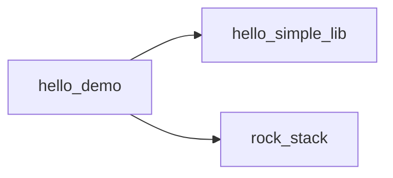

# test_projects

本目录下每一个子目录都是一个独立测试包：根目录放 `package.xml`；每个 CMake 目标独占一个子目录，子目录内恰好一个 `target.xml`。`<sources>` 中的路径相对于该 `target.xml` 所在目录。`configure` 会为整包生成 `add_library` / `add_executable` 并将同包下库链接到各可执行目标。

与 `build.py` / `install.py` 的关系：仓库根的 `build.py`、`install.py` 只构建并安装宿主工具 `up.exe` 与 `up-gui.exe`，不包含、不编译、不安装 `test_projects/` 下的测试包。

## 子项目一览

| 子目录 | 一句话 |
|--------|--------|
| [hello_simple_lib/](hello_simple_lib/) | 最简单独立静态库包：`hello_simple_lib`、`hello_simple_lib_tool`、`hello_simple_lib_test`。 |
| [hello_demo/](hello_demo/) | 演示本包 `hello_foo` + 跨包 `hello_simple_lib`、`rock_stack` 的联合调用与测试。 |
| [rock_stack/](rock_stack/) | 演示 `include/src/app/test` 布局及 `includes` 的 `dir/file/glob` 三种 `from/to` 写法。 |

### 包依赖关系



- `hello_simple_lib`：无包级依赖。
- `rock_stack`：无包级依赖。
- `hello_demo`：依赖 `hello_simple_lib`、`rock_stack`（另有可选占位 `none`）。

---

## hello_simple_lib

定位：最简独立 C++ 库包，验证“库 + 工具可执行 + 单元测试可执行”的基本模式。

- 包名：`hello_simple_lib`
- 目标：
  - `hello_simple_lib`（`static_library`）
  - `hello_simple_lib_tool`（`executable`）
  - `hello_simple_lib_test`（`executable`）

库 API：`version`、`normalize_name`、`add`、`Counter`、`Greeter`、`make_range`。

---

## hello_demo

定位：演示包内多目标 + 跨包依赖调用。

- 包名：`hello_demo`
- 依赖包：`hello_simple_lib`、`rock_stack`（及可选占位 `none`）
- 目标：
  - `hello_foo`（本包静态库）
  - `hello_demo`（主程序，调用 `hello_foo` + `hello_simple_lib` + `rock_stack`）
  - `hello_foo_test`（本包单测）

---

## rock_stack

定位：演示 `include/<库名>/`、`src/<库名>/`、`app/`、`test/` 的常见拆分。

- 包名：`rock_stack`
- 库目标：`rockBase`、`rockNet`、`rockBus`
- 可执行：`rock_app_one`、`rock_app_two`
- 测试：`rockBase_test`、`rockNet_test`、`rockBus_test`

`includes` 新语法示例（相对 `target.xml`）：

- `dir`：`<dir from="../../include/rockBase" to="rockBase"/>`
- `file`：`<file from="../../include/rockNet/rock_net.hpp" to="rockNet"/>`
- `glob`：`<glob from="../../include/rockBus/*.hpp" to="rockBus"/>`

---

## 在仓库根目录执行（已构建 `up.exe`）

```powershell
.\_build\Release\up.exe configure --scan test_projects
.\_build\Release\up.exe build
.\_build\Release\up.exe test
.\_build\Release\up.exe run hello_demo
```

单独运行 `hello_simple_lib` 包内工具：

```powershell
.\_build\Release\up.exe run hello_simple_lib_tool
```

在 `rock_stack` 包目录单独执行：

```powershell
Set-Location test_projects\rock_stack
..\_build\Release\up.exe configure
..\_build\Release\up.exe build
..\_build\Release\up.exe test
..\_build\Release\up.exe run rock_app_one
```
